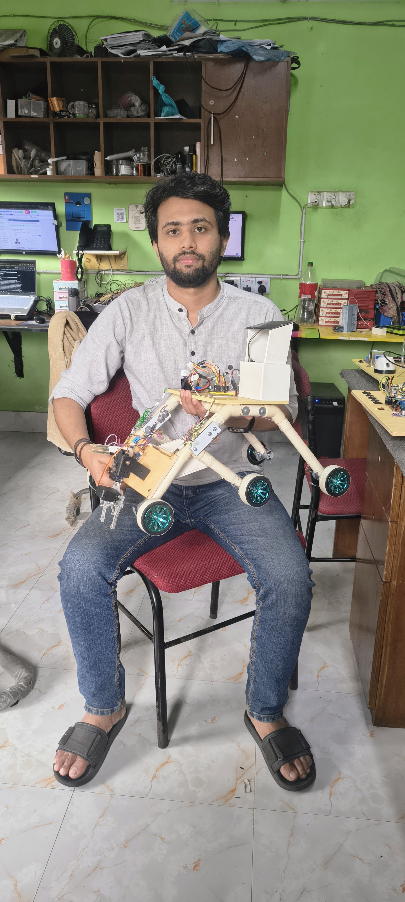

# ESP32 IoT Car with Sensors & Servo Control

 <!-- Add your banner image here -->

## Overview
This project is an **IoT-enabled robotic car** using ESP32. It integrates:

- **Ultrasonic Sensor** for obstacle detection and alerting
- **Servo Motors (3x)** for object handling
- **DHT11 Sensor** for temperature and humidity
- **Soil Moisture Sensor** for monitoring plant watering needs
- **L298N Motor Driver** for controlling a 4-wheel car
- **Wi-Fi AP** for hosting a web-based control panel

The system allows **real-time monitoring and control** of the car via a web browser without refreshing the page. Distance and alerts are displayed separately and update automatically.

---

## Features

1. **Real-time Distance Monitoring**  
   - Distance in cm is displayed continuously.  
   - Alert appears if an object is closer than 20 cm.

    <!-- Screenshot of web UI -->

2. **Servo Control**  
   - Three servos can be controlled individually:  
     - Servo1: 0–40°  
     - Servo2: 0–180°  
     - Servo3: 70–180°  
   - Control via web buttons.

    <!-- Screenshot of servo buttons -->

3. **Car Movement Control**  
   - Forward, Backward, Left, Right, Stop  
   - Works with mouse click or touch on mobile.

    <!-- Screenshot of car control section -->

4. **Moisture & DHT Monitoring**  
   - Soil moisture status: Wet / Dry  
   - Temperature & Humidity readings in real-time

    <!-- Screenshot showing moisture, temp, humidity -->

---

## System Components

| Component          | Purpose                                     |
|-------------------|--------------------------------------------|
| ESP32              | Main microcontroller                        |
| Servo Motor x3     | Manipulator / object handling              |
| Ultrasonic Sensor  | Obstacle detection                          |
| DHT11              | Temperature & humidity monitoring          |
| Moisture Sensor    | Soil moisture monitoring                    |
| L298N Motor Driver | Drive 4 DC motors for movement             |
| Web Browser        | Remote control & monitoring via Wi-Fi      |

---

## Wiring Diagram

 <!-- Add wiring diagram image -->

- **Servo1:** GPIO14  
- **Servo2:** GPIO12  
- **Servo3:** GPIO13  
- **Ultrasonic Trig:** GPIO5  
- **Ultrasonic Echo:** GPIO18  
- **DHT11:** GPIO25  
- **Moisture Sensor:** GPIO34  
- **L298N Motor Inputs:** IN1=GPIO26, IN2=GPIO27, IN3=GPIO32, IN4=GPIO33  

---

## Usage

1. **Upload the Arduino code** to ESP32.  
2. **Connect to ESP32 Wi-Fi**: `SSID: ESP32_AP`, Password: `12345678`.  
3. Open a **web browser** and navigate to the IP shown in Serial Monitor (default: `192.168.4.1`).  
4. **Control servos and car** using the web interface.  
5. **Monitor distance, alert, temperature, humidity, and soil moisture** in real-time.  

---

## Web Interface

- **Distance:** Shows in cm continuously.  
- **Alert:** Displays if an obstacle is near (<20cm).  
- **Servo Controls:** Individual buttons for each servo.  
- **Car Controls:** Forward, Backward, Left, Right, Stop buttons.  
- **Sensor Monitoring:** Soil moisture, Temperature, Humidity.

---

## Project Images

1. **Project Overview:** `images/banner.png`  
2. **Web UI - Distance & Alert:** `images/distance_alert.png`  
3. **Servo Controls:** `images/servo_control.png`  
4. **Car Controls:** `images/car_control.png`  
5. **Sensor Readings:** `images/sensors.png`  
6. **Wiring Diagram:** `images/wiring_diagram.png`  

> You can replace the placeholders with your own images in the `images/` folder in your GitHub repo.

---

## Future Improvements

- Make **alerts blink red** on the UI for better visibility.  
- Add **mobile-friendly layout** for car control.  
- Integrate **camera feed** for remote monitoring.  
- Log sensor data to **Google Sheets or cloud** for IoT analytics.  

---

